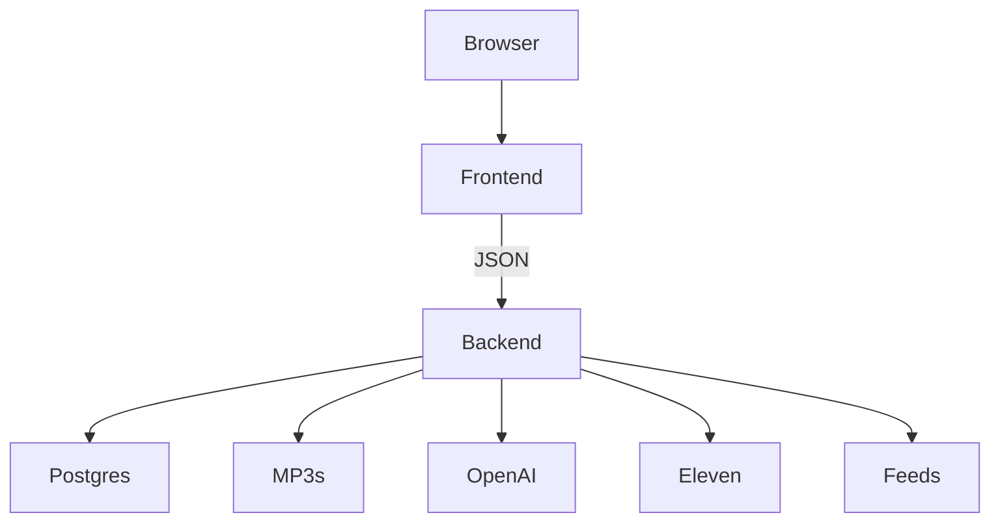
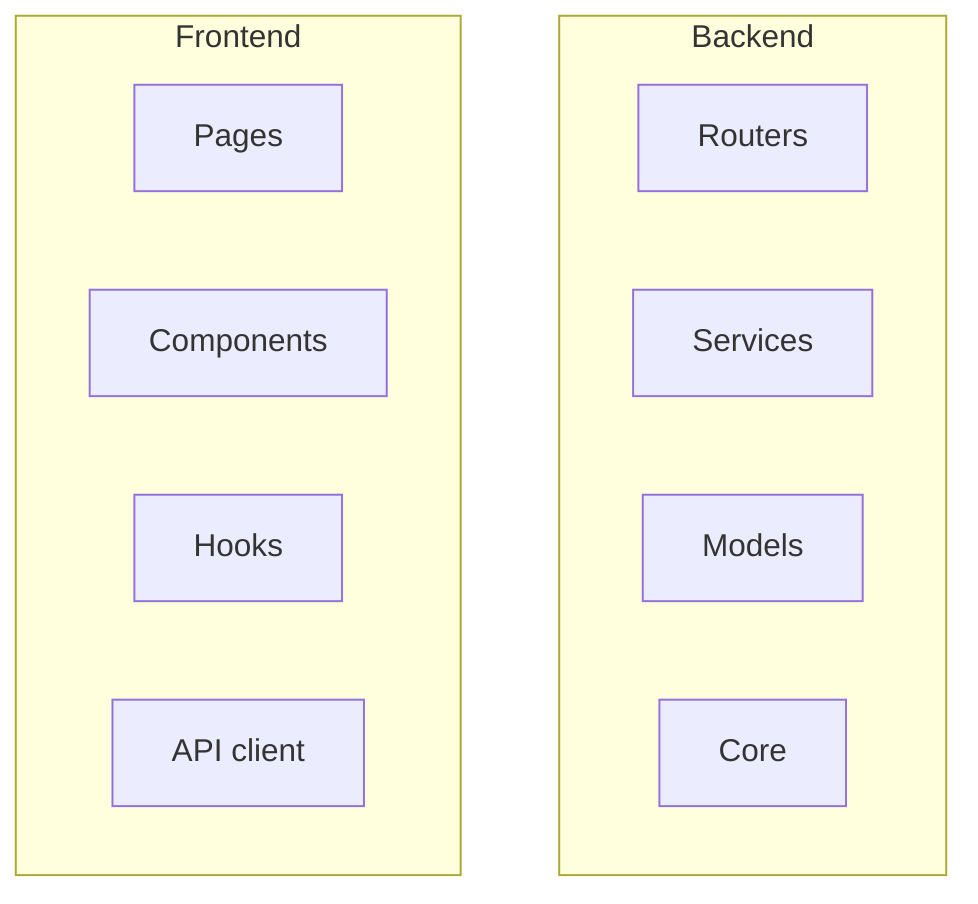

# Personalized Podcast Generator

Generate a personalized daily audio podcast from current news, tailored to each
user's interests, voice, tone, length, and schedule. FastAPI (Python) plus
PostgreSQL backend, Next.js (TypeScript) frontend, OpenAI for the writing
pipeline, ElevenLabs for speech.

## 1. Project overview

The app collects fresh news from several providers, ranks it against the user's
interests, writes an engaging script through a three stage OpenAI pipeline,
synthesizes natural audio with ElevenLabs, and delivers a daily episode the user
can play, browse, and download. An internal analytics dashboard gives an operator
view of latency, reliability, and usage.

Key capabilities:

1. Onboarding flow that captures name, interests, voice, tone, length, and daily schedule.
2. Concurrent, resilient news collection with caching, deduplication, ranking, and full text extraction.
3. Three stage AI pipeline (summarize, outline, script) with machine enforced structured outputs.
4. Background episode generation with polling, timeout, and crash recovery.
5. ElevenLabs audio with request stitching, merged into one seekable MP3.
6. Scheduled daily generation via an in process scheduler.
7. Internal analytics dashboard built with Recharts.

## 2. System prerequisites

1. Docker and Docker Compose (the recommended path; everything runs in containers).
2. ffmpeg is required for audio merging. It is installed inside the backend image automatically, so no host install is needed when using Docker.
3. For running outside Docker: Python 3.12, Node.js 22, PostgreSQL 16, and ffmpeg on the host.

## 3. Environment variables

Copy the template and fill in the values:

```
cp .env.example .env
```

1. POSTGRES_USER, POSTGRES_PASSWORD, POSTGRES_DB: Postgres credentials used by Compose.
2. DATABASE_URL: async SQLAlchemy connection string.
3. CORS_ORIGINS: allowed frontend origin.
4. OPENAI_API_KEY: required for script generation and the sample.
5. ELEVENLABS_API_KEY: required for audio synthesis and the sample.

API keys stay server side and are never shipped to the browser.

## 4. How to run the app

One command brings up Postgres, the backend, and the frontend with health checks
so services start in the correct order:

```
docker compose up
```

Then open the frontend at http://localhost:3000 and the API at
http://localhost:8000. On first start the backend applies migrations and seeds a
demo user with preferences. No analytics are seeded: every number on the
dashboard is captured from real usage, so a fresh install starts at zero.

The stack:



## 5. How to run tests

Backend (lint, types, and unit plus API tests, all offline with mocked externals):

```
docker compose run backend ruff check .
docker compose run backend mypy app
docker compose run backend pytest
```

Frontend (type checks, lint, and unit tests):

```
docker compose run frontend npm run typecheck
docker compose run frontend npm run lint
docker compose run frontend npm run test
```

Automated tests never call OpenAI, ElevenLabs, or the news providers, so they
spend no API credits.

## 6. Producing the sample episode

The headless script runs the exact production pipeline (under a dedicated
sample user, so the demo user's preferences are untouched) and writes the file
to `backend/sample_out/sample.mp3` on the host. It needs both API keys and a
running database:

```
docker compose up -d db
docker compose run backend python -m scripts.make_sample
cp backend/sample_out/sample.mp3 sample.mp3
```

The committed `sample.mp3` at the repository root is the best episode produced
this way.

## 7. Type safe API contract

The backend emits an OpenAPI schema at /openapi.json. The frontend can generate
typed request and response definitions from it:

```
docker compose run frontend npm run gen:api
```

This keeps one source of truth (the Pydantic models) and surfaces a compile error
the moment the backend contract drifts from the frontend.

## 8. Project layout



Backend services: news, ai, audio, analytics, scheduler, generation. Backend
core: config, retry, logging, ratelimit. Frontend components: dashboard, player,
settings, analytics, ui.

## 9. Known limitations and troubleshooting

1. The scheduler is in process and single node; schedule times are interpreted
   as UTC (the settings page says so next to the time field).
2. Generation returns 409 while an episode is already in flight for the user —
   wait for it to finish (or for the generation timeout, default 300s).
3. If `docker compose up` fails on the backend, check that `.env` exists (copy
   `.env.example`) — the backend reads it via Compose `env_file`.
4. A failed episode keeps a short, user readable error; the raw provider error
   is in the backend logs and the generation job rows.

For a deeper explanation of the design, the trade offs, and the full
limitations list, see solution.md.
