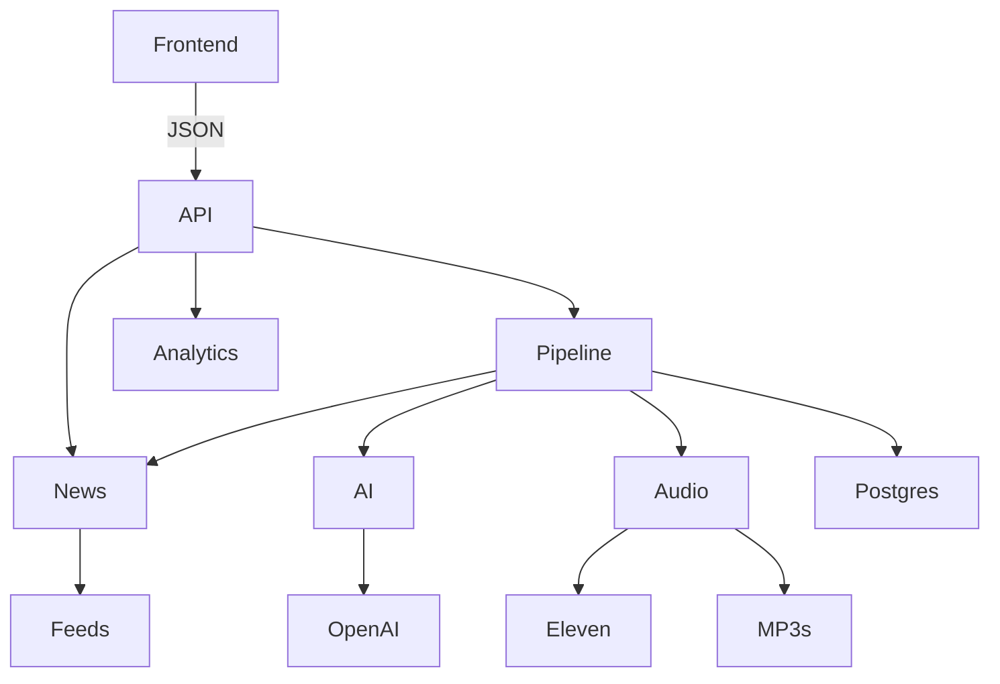
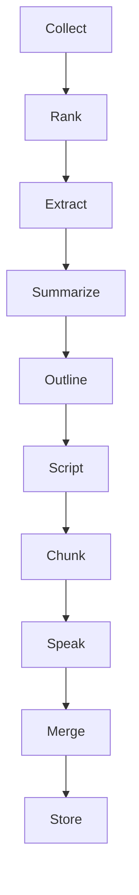

# Solution

A retrospective on what was built, the architecture, the trade offs, and how it
was verified.

## 1. What was built

A production quality full stack app that turns current news into a personalized
daily audio podcast. The user onboards with their interests, voice, tone, length,
and schedule. The app then collects news, ranks it, writes a script through a
multi stage AI pipeline, synthesizes speech, and delivers an episode with a
player, history, and an internal analytics view.

Delivered surface:

1. Onboarding, dashboard with player, episode history, settings, and an analytics dashboard. Interests are preset chips plus free text topics (validated server side: trimmed, case insensitively deduplicated, capped at 20 topics of 100 characters).
2. A FastAPI backend with routers for news, generation, episodes, preferences, and dashboard.
3. A three stage OpenAI pipeline with structured outputs.
4. ElevenLabs audio with request stitching and merged, seekable MP3 output.
5. Background generation with polling, timeout, and crash recovery.
6. In process scheduling for daily episodes.
7. A resilient news layer with providers, caching, deduplication, ranking, and full text extraction.
8. A test suite that runs fully offline, plus lint and type gates and a CI workflow.

## 2. Architecture overview

The system splits into a typed frontend and a Python backend that owns the
pipeline. The frontend never holds business logic; the backend keeps logic in
services rather than routers.

## 3. Generation pipeline

The pipeline is the heart of the product. It runs as a background task so the
request returns immediately with the episode id, and the frontend polls for
status.

Each stage writes a job row, so status polling, the failed jobs metric, and the
latency tile are all backed by real captured numbers. Token and character counts
are logged on the job rows too, but cost tiles were deliberately dropped: the
rows record total tokens without the input/output split, and output tokens are
priced roughly 8x input, so any single rate dollar figure would materially
understate real spend. Showing no number beats showing a wrong one.

## 4. Key trade offs

1. FastAPI split versus an all in Next.js backend. The role centers on FastAPI plus PostgreSQL, so the backend is a separate Python service. The cost is a second service and a type boundary; both are handled by Compose for one command run and by OpenAPI to TypeScript generation so the contract cannot silently drift.
2. SQLAlchemy versus Prisma. Prisma is TypeScript only and would drag logic back into Next. SQLAlchemy keeps the pipeline in Python where the async workers live.
3. Multi stage LLM versus one large prompt. More calls, but each stage is testable and debuggable, tokens are capped before the expensive script stage, and quality is higher.
4. In process scheduler versus distributed workers. The brief asks for scheduling, so the app actually schedules with about thirty lines and no extra infrastructure. Jobs die with the process and do not coordinate across nodes; the production path is a cloud cron or a beat worker hitting the same code path, and idempotency makes double fires safe.
5. Keyword ranking versus embeddings. Keyword and TF style matching is free, deterministic, and unit testable, with an embedding swap available behind the same interface.
6. Local file storage versus object storage. MP3s are stored locally behind a storage interface, so production can swap to a cloud store without touching callers.

## 5. Phase summary

The build followed a strict phase order with cumulative testing after each phase.

1. Phase 0: repository scaffold, Compose with health checks, and the environment template.
2. Phase 1: data models, migrations, and seed data.
3. Phase 2: the news service and the news endpoint.
4. Phase 3: the AI pipeline and background generation with polling.
5. Phase 4: the audio service and full episodes with seekable MP3 serving.
6. Phase 5: the frontend core (onboarding, dashboard, player, history).
7. Phase 6: the internal analytics dashboard.
8. Phase 7: scheduling, resilience, structured logging, rate limiting, CI, and polish.
9. Phase 8: the headless sample script, the sample audio, and the documentation.

## 6. Testing summary

1. Backend unit tests cover the ranking scorer, on topic story selection, deduplication, cache expiry, chunking, and the length mappings.
2. API tests cover the news, generate, episodes, preferences, and dashboard routes with mocked externals.
3. Resilience tests cover retry with backoff, the rate limiter, scheduler registration, the error envelope, and the crash recovery sweep.
4. The frontend gate is a strict type check plus lint plus a small set of unit tests on the typed client and utilities.
5. Every automated test runs offline, so no run spends API credits. Live runs were used only to verify the real pipeline and to produce the sample.

Result at submission: the full backend suite passes, lint and types are clean, and
the frontend type check, lint, and tests pass.

## 7. Known limitations

1. The scheduler is in process and single node; it does not survive a crash or coordinate across replicas.
2. The analytics dashboard shows only real captured metrics. The seeded history and trend charts were removed at the user's request, so on a fresh single user demo the numbers are small but every one of them is real.
3. Authentication is a single demo user; there is no real auth, billing, or multi tenancy in this iteration.
4. Concurrent speech synthesis is left as an optimization; the default is sequential because the user never waits on it.
5. News coverage is only as broad as the provider list. Feeds span general, tech, science, and sports; a very narrow interest with no matching feed can yield fewer stories, and the selection step keeps them on topic rather than padding with off topic filler. If collection returns nothing at all, the episode fails fast with a clear message instead of asking the model to write about nothing.
6. Failed episodes show a short, user readable error in the UI; the raw provider error is kept in the logs and the generation job rows for debugging.
7. A new generation request is rejected with 409 while the user already has one in flight, and the schedule time is interpreted as UTC.

## 8. Where to look

The README covers setup, environment, running, and tests. The plan and the full
scope live in prd.md. The sample episode is sample.mp3 at the repository root.
